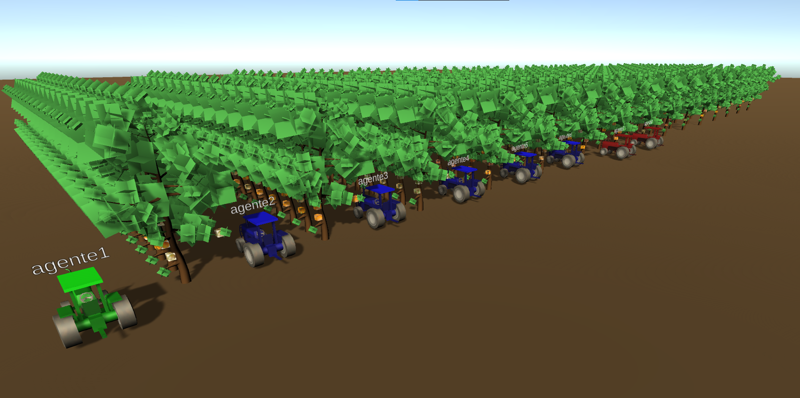
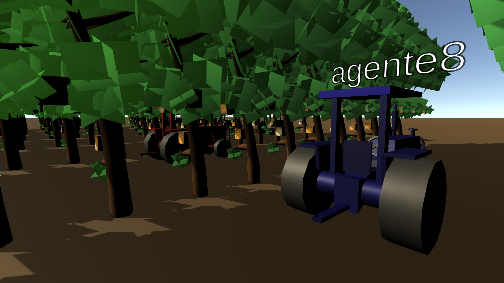

# FIVE: Flexible Intelligent Virtual Environment designer 
FIVE is a multi-platform, distributed software created for testing Multi-Agent Systems that helps you to design high customized 3D intelligent virtual environments.

FIVE is composed by:
- FIVE Server coded in Unity.
- FIVE Agents based on SPADE Python agents.

## Installation
FIVE is available for Windows, Linux and MacOS. You will found a *vanilla* version at [release](release/) with all the OS builded versions of the FIVE (Unity) server. If you prefer to build the server yourself, you can clone the [src/simulator](src/simulator/) folder and compile your own version.

The SPADE agents require to clone the [src/agents](src/agents/) folder and install the SPADE package. You can install it by executing:

`
pip install spade
`	

## Usage
We can define the agents of our simulation, and the IVE features and objects placed in it. In order to archive this purpouse we have to tweak the configuration files:

> **Note**: There is a [website](https://franenguix.github.io/five/web/) under progress that will help you tweak this files in the future.

### FIVE Server
You have to configure **map.txt**, **map_config.json** and **map.json** files.
- **map.txt** lets you design an environment map by writing ASCII characters.
- **map_config.json** is used to create a link between the characters of the **map.txt** to the object of the environment. For example, you may want to create a forest with certain distribution of trees, so you can write a 'T' character in **map.txt** and then create a link with the Unity object (prefab) in **map_config.json**.
- **map.json** it is used to instantiate highly customized individual objects and light conditions. For example, you can define an empty object and name it "Agent spawner" and assign a position to it; then, you can reference this empty object by its name in **configuration.json** file and set it as the starting point of the agents. 

### FIVE Agents
Agents only require one configuration file, which is named **configuration.json**. This file has two sections:
- **fiveserver** is used to specify the fiveserver name and domain at the XMPP server, so agents are able to communicate with it.
- **agents** is a list of agents so we can set the agent name, avatar, starting position, etc. 

The file that contains the code of the agent is **entity_shell.py**. We have to place the code of the agents here, and agents will share the same behaviour. In order to have different agents with differents behaviours, we have to clone the agents' python files and run it with modified versions of **entity_shell.py** and **configuration.json** files. We have planned a simplified version in the future, so we will only need to set the name of the file that contains the code of the agent in **configuration.json**.

### Run FIVE

To run the IVE with the inhabitant agents you have to:
1. Run the XMPP server.
2. Run the FIVE server (Unity).
3. Run the agents by executing the **launcher.py** file.

## Preconfigured example
When you clone this project, you will found under release